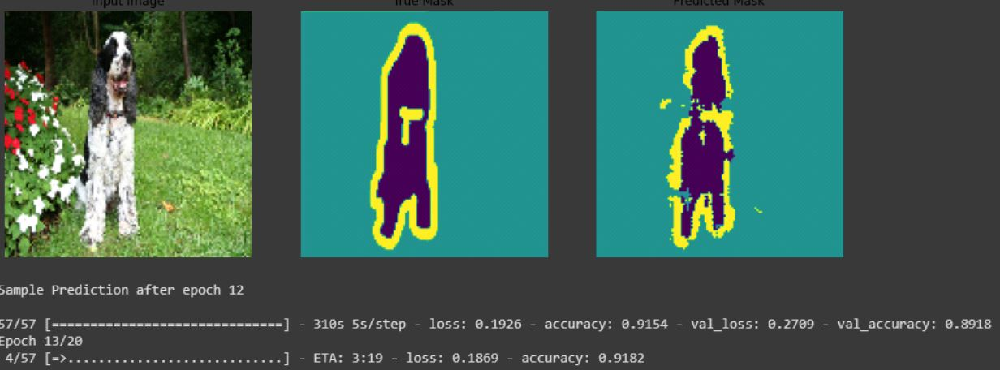

# Image-Segmentation
Pixel-wise image segmentation 

The model has attained an accuracy of 89% on the Validation dataset, and as expected its higher in training dataset -93.8%

Example results for the pre-trained models

Prediction after 12 epochs

  

Prediction after 20 epochs

 

Performance Improvement trend across epochs

 
